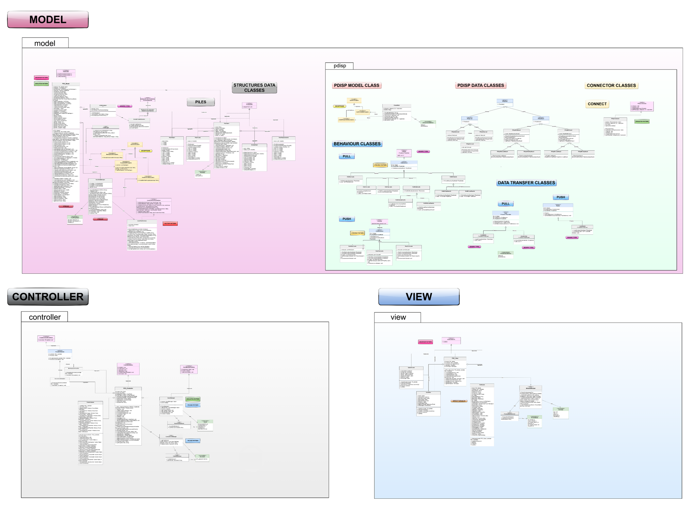
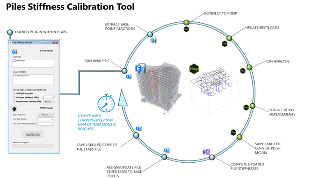
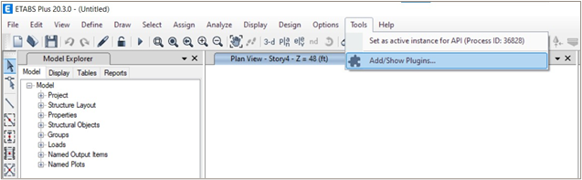
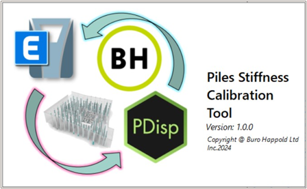
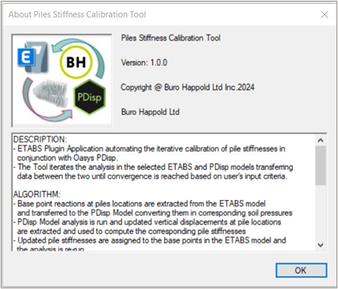
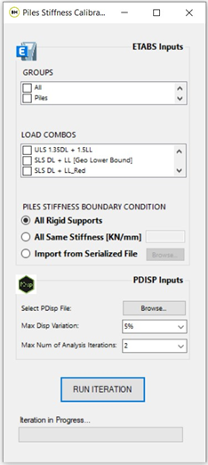
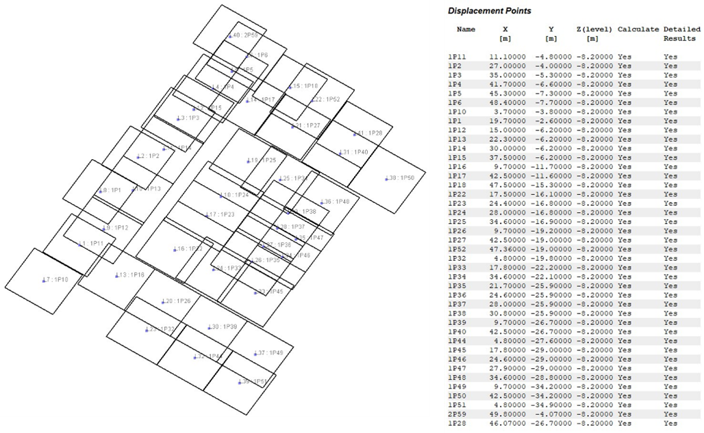
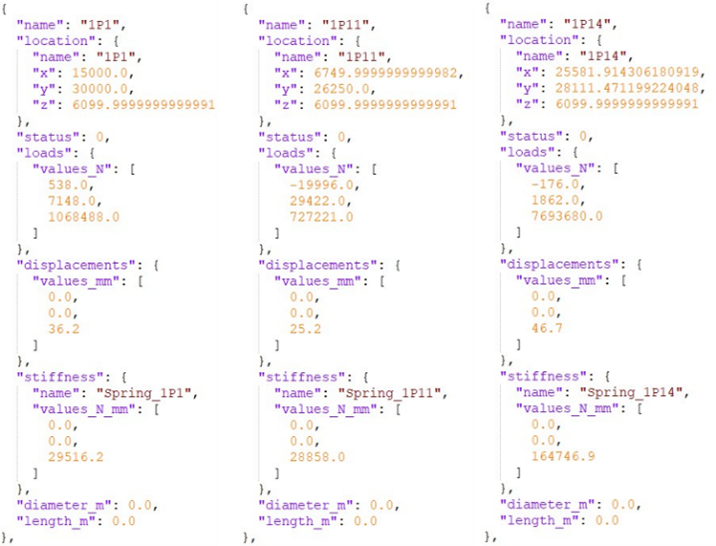
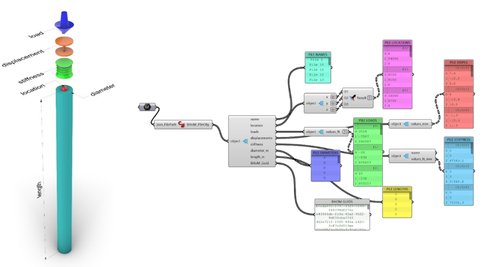
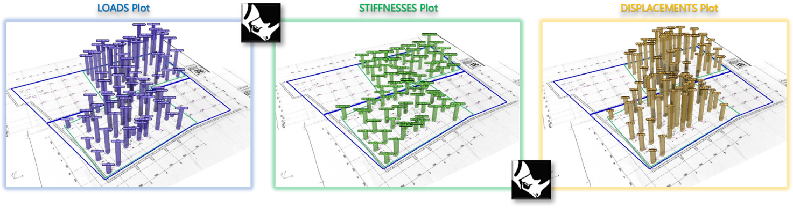

# 📐 Piles Stiffness Calibration Tool

  

## 📖 Description

The **Piles Stiffness Calibration Tool** is a CSI ETABS Plugin developed by **Buro Happold** to assist structural and geotechnical engineers in automating the calibration of pile stiffnesses under existing and proposed loads.  

It runs **parallel analyses** in:  
- **ETABS** → computes structural loads applied onto piles  
- **Oasys PDisp** → determines pile stiffness  

The process continues until convergence criteria are met, and outputs are automatically documented for engineers.

  

*Figure 1: Overview of the tool’s algorithm steps*

---

## ⚙️ Installation

1. Open **ETABS** and create a new model.  
2. Navigate to **Tools → Add/Show Plugins**.  
3. In *External Plugin Data*, click **Browse** and select `Piles_Stiffness_Calibration.dll`.  
4. Confirm details and click **Add**.  
5. Click **OK**. The plugin will now appear under the **Tools** menu.  

  
*Figure 2: Accessing the tool via ETABS UI*

---

## 🖥️ User Interface

### ETABS Tools UI
Access the plugin directly from the **Tools Menu** in ETABS.

### SplashScreen
Displays logo, name, version, and copyright.

  
*Figure 3: Tool’s Splashscreen Window*

### AboutBox
Contains description, algorithm, UI features, and limitations.  

  
*Figure 4: Tool’s AboutBox Window*

### Inputs Form
Main interface for selecting inputs, running iterations, and monitoring progress.

  
*Figure 5: Tool’s Inputs Form Window*

---

## 📥 Inputs

### ETABS Inputs
- **Groups** – pile nodes grouped in ETABS  
- **Load Combinations** – single selection required  
- **Piles Stiffness Boundary Condition**:  
  - All Rigid Supports  
  - All Same Stiffness [kN/mm]  
  - Import from Serialized File  

### PDisp Inputs
- **PDisp File** – must match pile node names with ETABS  
- **Maximum Displacement Variation** – % threshold for convergence  
- **Maximum Number of Iterations** – 2–100  

  
*Figure 6: PDisp Model (3D View + Pile Points List)*

---

## 📤 Outputs

### JSON Dataset
Iteration results serialized in JSON for lightweight storage and cross-platform use.

  
*Figure 7: Sample JSON File Content*

### Grasshopper/Rhino Visualization
Import JSON into Grasshopper for advanced 3D visualization.

  
*Figure 8: C# Component for JSON deserialization*

  
*Figure 9: 3D Visualization in Rhino via Grasshopper*

### Excel Spreadsheet
Automatically generated tables and charts for iteration outputs.

  
*Figure 10: Excel Outputs – Table & Charts*

### ETABS & PDisp Models
Saved per iteration for full traceability.

---

## 📊 Workflow Example

1. Run calibration in ETABS + PDisp.  
2. Export JSON results.  
3. Import JSON into Grasshopper for visualization.  
4. Review Excel outputs for iteration trends.  
5. Access saved ETABS/PDisp models for detailed analysis.  

---

## 📜 License

---